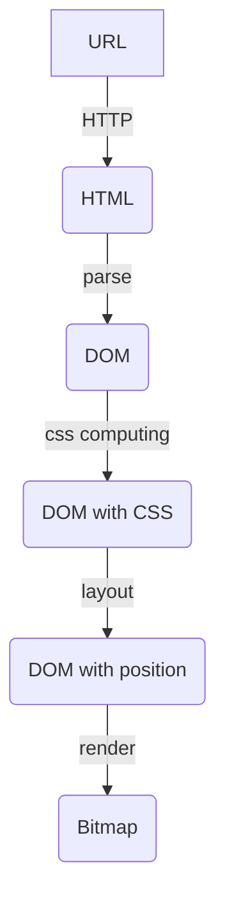
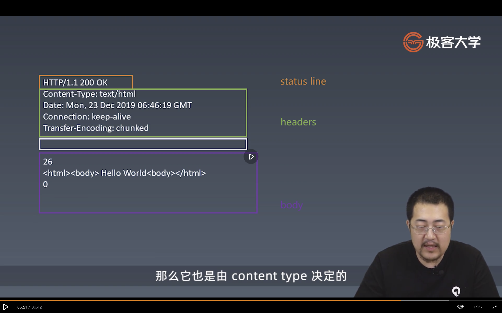

学习笔记

### 有限状态机
每一个状态都是一个机器
每一个机器知道下一个状态

### 用状态机实现：字符串“abcabx”的解析
```js
const match = (str) => {
    let state = start
    for(let c of str){
      state = state(c)
    }
    return state === end                
  }

  const start = c => c ==='a'? foundA:start
  const end = () => end
  const foundA = c => c ==='b'? foundB : start(c) 
  const foundB = c => c ==='c'? foundC : start(c)  
  const foundC = c => c ==='a'? foundA2 : start(c)  
  const foundA2 = c => c ==='b'? foundB2 : start(c) 
  const foundB2 = c => c === 'x'? end : foundB(c)  

  console.log(match('abcabcabx'))
  console.log(match('abcaabcabx'))
  console.log(match('abcaabbcabx'))
```
 ### 用状态机实现：字符串“abababx”的解析
```js
const match = (str) => {
    let state = start
    for(let c of str){
      state = state(c)
    }
    return state === end                
  }

  const start = c => c ==='a'? foundA:start
  const end = () => end
  const foundA = c => c ==='b'? foundB : start(c) 
  const foundB = c => c ==='a'? foundA2 : start(c)  
  const foundA2 = c => c ==='b'? foundB2 : start(c) 
  const foundB2 = c => c ==='a'? foundA3 : start(c)  
  const foundA3 = c => c ==='b'? foundX : start(c)  
  const foundX = c => c === 'x'? end : foundB2(c)   

  console.log(match('ababababx'))
  console.log(match('abaaabababx'))
  console.log(match('abababaabababx'))
  console.log(match('abababaabaababx'))
  //reconsume 重组技巧
  ```
KMP资料阅读，按照JAVA版的改了下没有实现 ，js Class语法不熟悉 需要加强训练。

### HTTP请求
####  HTTP协议解析
####  服务端环境准备
####  实现一个HTTP请求
####  send函数编写了解response格式
####  发送请求
####  response解析


#### 浏览器架构图

### 第一步 HTTP请求总结

- 设计一个HTTP请求的类
- content type 是一个毕业的字段，要有默认值
- body是KV格式
- 不同的content-type影响body的格式

### 第二步 send函数总结

- 在Request的构造器中收集必要的信息
- 设计一个send函数，把请求真实的发送到服务器
- send函数应是异步的，所以要返回Promise

> http 请求格式



### 第三步 发送请求

- 设计支持已有的connection或者自己新建connection
- 收到数据传给parser
- 根据parser的状态resolve Promise

### 第四步 ResponseParser状态机总结

- Response必须分段构造，所以我们要用一个ResponseParser来“装配”
- ResponseParser分段处理ResponseText,我们用状态机来分析文本的结构

### 第四步 ResponseParser状态机总结

- Response必须分段构造，所以我们要用一个ResponseParser来“装配”
- ResponseParser分段处理ResponseText,我们用状态机来分析文本的结构

### 第五步 BodyParser状态机总结

- Response的body可能根据Content-Type有不同的结构，因此我们会采用子Parser的结构来解决问题
- 以TrunkedBodyParser为例，我们同样用状态机来处理body的格式
