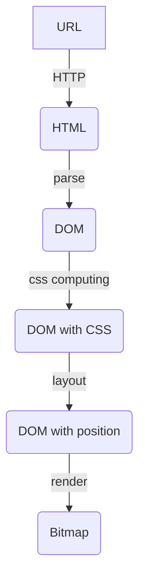

学习笔记
浏览器架构
#### 浏览器架构图

### 第一步 排版-根据浏览器属性进行排版（FLEX）
> 三代排版技术
> 1.古典 2.flex 3.grid 4.CSS Houdini

- 采用flex布局
-
### 第二步 排版-收集元素

- 设计一个HTTP请求的类
- content type 是一个毕业的字段，要有默认值
- body是KV格式
- 不同的content-type影响body的格式

### 第三步 排版-计算主轴

### 第四步 排版-计算交叉轴

### 第五步 渲染-绘制单个元素

-  绘制需要依赖一个图形环境
-  采用了npm包的images
-  绘制在一个viewport上进行
-  与绘制相关的属性 background-color、border、background-image等
### 第六步 渲染-绘制DOM树

- 递归调用子元素方法完成DOM树的绘制
- 忽略一些不需要绘制的节点
- 实际浏览器中，文字绘制是难点，需要依赖字体库
- 实际浏览器中，还会对一些土城做compositing